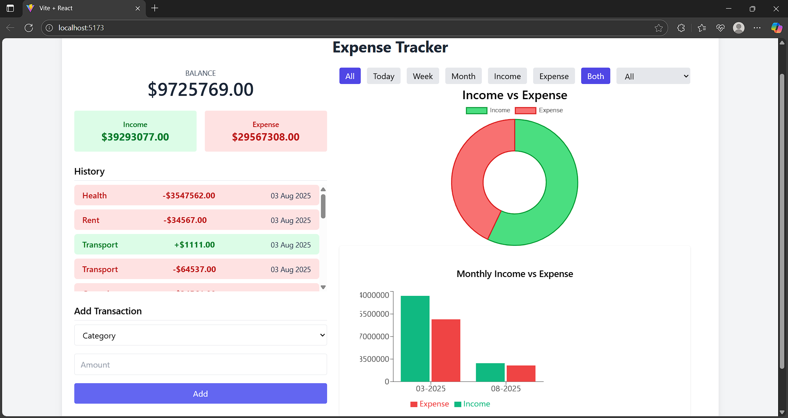

# 💸 WalletWise — Expense Tracker Web App

**SmartSpender** is a full-featured, responsive expense tracker built with **React** and **Tailwind CSS**. It allows users to manage income and expenses, visualize financial data, and filter transactions by date, category, and type. The app uses **Chart.js** to generate insightful visualizations and persists data using `localStorage`.

---

## 🚀 Features

* ✅ **Add Transactions** with description, amount, date, and category
* ✅ **Income & Expense Classification**
* ✅ **Date Filters**: View transactions for Today, This Week, and This Month
* ✅ **Category Filter**: Choose from common categories like Food, Rent, Salary, etc.
* ✅ **Transaction Type Filter**: Income / Expense / Both
* ✅ **Responsive UI** built using Tailwind CSS
* ✅ **Data Persistence** with `localStorage`
* ✅ **Doughnut Chart** showing category-wise expense breakdown
* ✅ **Bar Chart** for Monthly income/expense trends (uses `date-fns`)
* ✅ **Context API** for global state management

---

## 📷 Screenshots

> 


---

## 🛠️ Technologies Used

* **React.js** – Frontend framework
* **Tailwind CSS** – Styling
* **Chart.js** – Doughnut and Bar charts
* **date-fns** – Date manipulation and formatting
* **Context API** – State management
* **localStorage** – Persistent transaction data

---

## ⚙️ Getting Started

### 1. Clone the repository

```bash
git clone https://github.com/yourusername/smartspender-expense-tracker.git
cd smartspender-expense-tracker
```

### 2. Install dependencies

```bash
npm install
```

### 3. Start the app

```bash
npm run dev
```

The app will be running at [http://localhost:5173](http://localhost:5173)

---

## 📁 Folder Structure

```
src/
│
├── components/
│   ├── DashBoard.jsx
│   ├── TransactionChart.jsx
│   ├── TransactionFilters.jsx
│   └── MonthlyTrendsCharts.jsx
│
├── context/
│   └── ExpenseContext.jsx
│
├── App.jsx
├── main.jsx
└── index.css
```

---

## 🎯 Future Improvements

* Add authentication (Firebase or Auth0)
* Cloud storage for transactions
* Dark mode support

---

## 📜 License

This project is open-source and available under the [MIT License](LICENSE).
